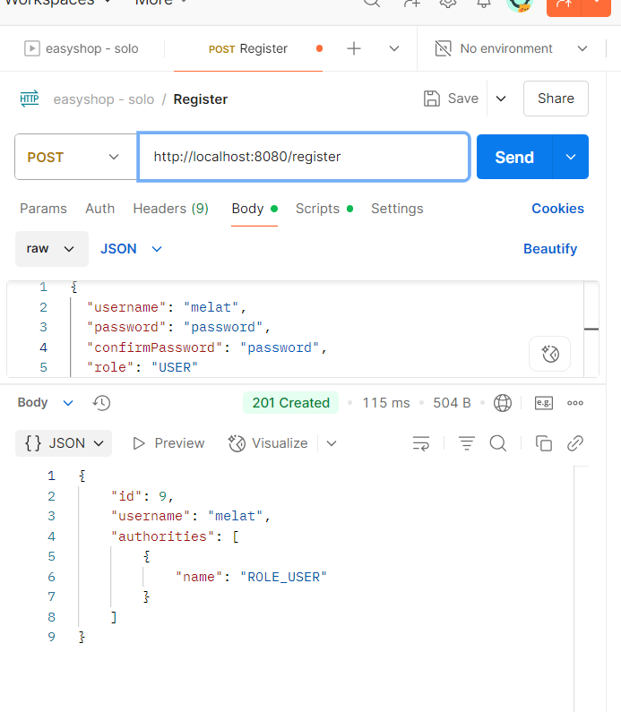
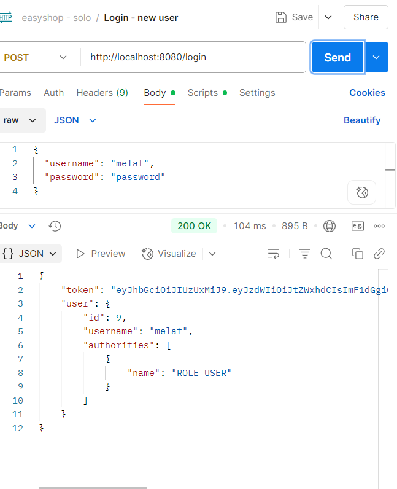
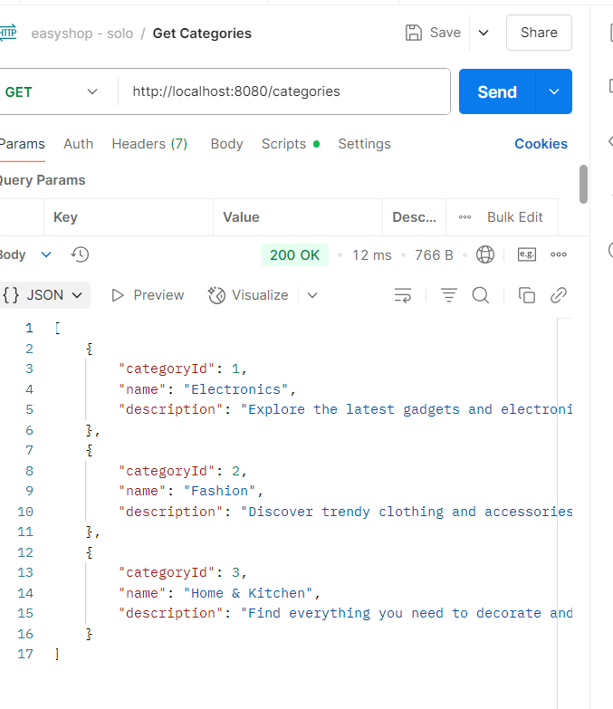
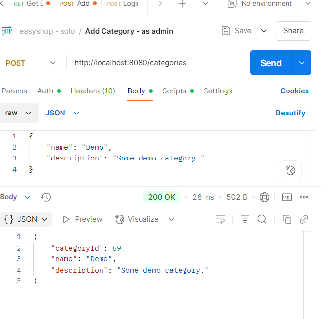
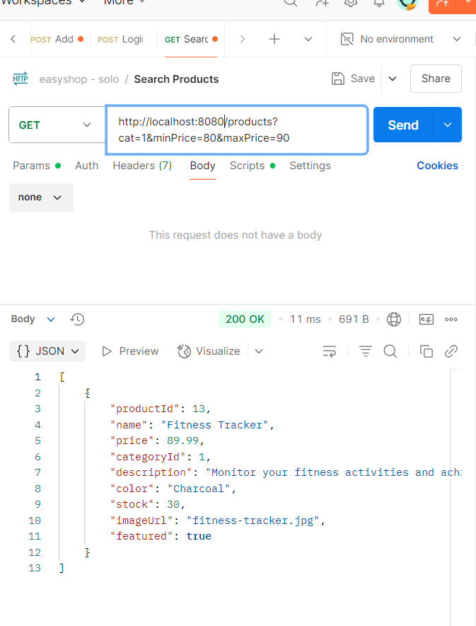

# EasyShop E-Commerce Web Application

EasyShop is a full-stack Java e-commerce application developed as a capstone project. It allows users to browse products, filter by category and price, add items to a shopping cart, and complete a checkout process. Admin users can manage product categories, including the ability to add and delete categories dynamically. The project uses a Spring Boot backend with MySQL for the database and a vanilla JavaScript frontend. The app features role-based authentication using JWT tokens, where users can register, log in, and see personalized content based on their role.

---

## Features

✅ Filter products by category and price  
✅ Add items to a shopping cart  
✅ Checkout and save order to database  
✅ Admins can add/delete categories  
✅ Display cart total  
✅ User profile with dynamic header based on login status  
✅ Role-based access control (admin/user)

---

## Project Structure

- *Backend:*
    - src/main/java/org/yearup
        - configurations: Spring security and JWT config
        - controllers: REST API controllers
        - data: DAOs 
        - models: Entity classes
        - security: Token filters and services
    - resources: application.properties, schema/data SQL
    - EasyshopApplication.java: Main launcher

- *Frontend:*
    - capstone-client-web-application
        - js/services: JavaScript service classes
        - templateBuilder.js: For rendering UI
        - index.html: Main UI
        - CSS files for styling
        - Images and basic layout templates

---

## How to Run

1. Set up a MySQL database named easyshop.
2. Open the backend project in IntelliJ and configure the database credentials in application.properties.
3. Run EasyshopApplication.java.
4. Open the index.html file in your browser to start using the app.

---

## Technologies

- Java 17
- Spring Boot
- MySQL
- JavaScript (vanilla)
- HTML/CSS
- JWT for authentication

---
## postman Screenshots
### register

### login

### getCategories

### add categories as admin

### searchProducts

## Future Improvements

✨ Add order history: users will be able to log in and view all past orders.   
✨ Add product image upload functionality.  
✨ Add review and rating system for products.  
✨ Add advanced filtering and sorting options.  
✨ Admin dashboard with analytics.  
✨ Add delivery address options on checkout.  
✨ Add search bar and wishlist features.

---

## License

This project is open-source and free to use for educational purposes.